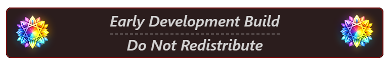

<!--
"Early Development Build" Header
-->
<!--
<i style="text-align: center; font-size: 14px; font-weight: bold; border-bottom: 1px solid #FF00005F; border-top: 1px solid #FF00005F; margin-top: 10px; margin-bottom: 10px; background-color: #FF0F0F0F; border-left: 1px solid #FF00005F; border-right: 1px solid #FF00005F; border-radius: 5px;">
Early Development Build Do Not Redistribute
</i>
-->

---

<h1 align="center" style="padding-bottom: 0px; margin-bottom: 0px; font-size: 15px;">
  
  <i><strong>VS: Bloom</strong></i>
  
</h1>

## What is VS: Bloom?

VSBloom is an extension which visually overhauls the Visual Studio Code experience with dynamic animated effects and fresh approaches to the application's UI, far beyond what traditional VS Code themes can offer.

Unlike standard color themes that only change things like syntax highlighting and window backgrounds, VSBloom's focus is not to present yet another color palette to choose from; instead it renders actual *animations* — trails that follow your cursor as it types, blur effects that respond to window focus, etc.

## How It Works

VSBloom works differently from typical VS Code extensions and its effects are made *possible* by a small multi-layer "modding framework" of sorts for the VS Code client:

1. **Installation**: When you first install the VSBloom extension, you'll see a prompt appear asking for your permission to apply a small patch to VS Code's Electron Renderer, this is required for the extension to interact with the rendered HTML page that VS Code displays to you. After this patch is installed, you'll see one more prompt asking you to reload the VS Code window a single time - this will allow the extension to get going!

2. **Extension Bridge** — The patch that we apply to the Electron Renderer acts as a "client" which connects to the VS Code extension, allowing for real-time communication between the VS Code Extension Host and the Electron DOM to synchronize which effects are enabled as well as updating user configurations for effects without requiring a client restart - something which is usually *impossible* due to [restrictions](https://code.visualstudio.com/api/extension-capabilities/overview#restrictions) that VS Code imposes on Extensions.

3. **Modular Effect System** — All of the effects that VSBloom provides are are loaded and unloaded dynamically based on your settings, allowing for you to see changes in real-time as you update effect settings without needing to reload the window or restart VS Code; we attempt to ensure that **all effects** in VSBloom are individually toggleable and configurable to the largest extent possible!

## Current Features

- **Cursor Trails**: Watch as animated trails follow your cursor while you navigate through your code!
- **Window Focus Effects**: See the window react to losing focus and slowly dim itself into an idle-state as you leave the editor for extended periods of time!

- **Completely Configurable**: Tweak and tinker with effects to your hearts content! Everything is individually toggleable, so you can tune down or entirely disable any effects you find too distracting.

*(Extension is in early development, more effects coming soon!)*

## Command List

| Name | Description |
|---------|-------------|
| `VSBloom: Enable and Patch Electron Client` | Applies the client patch required to enable VSBloom's functionality |
| `VSBloom: Disable and Un-Patch Electron Client` | Removes VSBloom's client patching, disabling any and all effects |
| `VSBloom: Retry Electron Client Patching` | Removes the VSBloom client patching and promptly re-patches the client |
| `VSBloom: Reload All Effects` | Performs an immediate hot-reload of all currently active effects |

## Frequently Asked Questions

### Is VSBloom safe? What did you do to my VS Code?!

Yes! In order to enable DOM access for VSBloom to render its effects, the extension must modify VS Code's Electron Renderer process in order to patch in the "VSBloom Client", establishing a link between the Electron DOM and the Extension - Some important facts about these modifications are:
- Nothing is ever done without notifying you and asking for permission first.
- Every modification is completely reversible with a <u>single</u> command.
- Before modifying anything, backups are taken of all original files to ensure that if anything *does* break, fixing the app is easy.
- No modifications <u>ever</u> connect to - or send data to - any external IP's.
- VSBloom is <u>100%</u> Open Source - If you're suspicious about how we mod VSCode, feel free to look at the [source code](https://github.com/GabrielHoy/VSBloom) at any time!

### Why does my editor say "installation appears to be corrupt"?

This warning *can* appear due to VS Code detecting that modifications have been made to its files, often times when files are modified within VS Code it indicates that the app installation got corrupted somehow, or that malicious software/extensions have made some kind of modification to it behind the scenes - In order to detect this happening, VS Code
keeps track of the checksums for many application files during the time of VS Code's compilation and compares those stored checksums to the current file checksum at each launch;
if a mismatch is detected between the two, you'll see a warning that looks something like this:

VSBloom's client patching process makes changes to some of the files that VS Code keeps track of with these checksums - so even though this extension doesn't do anything malicious, you may still see a "corruption warning" like this and VS Code asking you to reinstall, purely due to the client being modified.

With that being said though, it's still not great UX to have a relatively scary warning like this popup each time you open VS Code, so VSBloom *does* attempt to update these file checksums as it makes changes to VSCode in an attempt to keep everything in sync and ensure the application stays "happy" - even with us updating checksums though, some "flavors" of VS Code such as the Cursor IDE keep an *internal copy* of these original file checksums cached per update instead of purely storing them in a `product.json` file, leading to ***any*** modifications of said files triggering a corruption warning regardless of the file checksum being updated or not.

If you notice this warning happening to you and dislike it, VSBloom provides a toggleable setting to suppress the client corruption notification in a more direct manner in addition to updating these checksums - The method we use to suppress these notifications is admittedly rather fragile, so if after an update of your IDE the notification suppression stops working and this setting no longer helps absolutely reach out or make a new issue on GitHub!

> **Note**: Enabling the above setting to suppress client modification warnings should be done at your own risk! Client corruption warnings exist for admittedly good reason in VS Code, and while the patches that VSBloom applies are not malicious the same cannot be said about other extensions on the marketplace or other applications which may modify VS Code for their own nefarious purposes.

### Will I need to reinstall VS: Bloom when VS Code updates?

No! The VSBloom extension checks to see if the VS Code application is still correctly patched every time that VS Code starts, so when VS Code updates and the patches from VSBloom get reverted you'll simply see a popup window asking you if it's OK to patch the VS Code client from VSBloom(just like the first time you installed the extension). Clicking **Yes** on this prompt should handle re-applying the patches that VSBloom needs to function, and after you reload the window all of VSBloom's functionality should work again.

Alternatively if this automatic re-patching flow does not trigger for some reason, you can always use the `Retry Electron Client Patching` command at any time to manually tell
VSBloom to un-patch and re-patch VS Code accordingly!

### Does VSBloom affect performance?

While VSBloom's effects *are* designed with an intention of being lightweight in mind the priority behind VSBloom is visual fidelity and eye candy, **not** blazing fast performance - so I can't realistically give a guaruntee that VSBloom won't cause some kind of degraded performance on lower end devices!

If you end up experiencing significant performance issues due to any effects that VSBloom provides, you can always configure the effect to try and reduce the resources it takes up
or disable said effect entirely: Due to how VSBloom works behind the scenes the code behind disabled effects literally **does not run** at all, so all performance impact associated with them should disappear as soon as you un-toggle an effect!

With that said though, even if performance is not the #1 "priority" I won't try to use that as an excuse, as such all effects are still designed to try and perform at least relatively well - if you notice any particular effect is unperformant or you've read the code behind an effect and notice room for optimization in any regard, absolutely make an issue on GitHub or contact me directly; I'll dig into it and I'm *always* open to contributors!

## External Libraries

VSBloom currently utilizes the following external libraries to accelerate development of the extension:
- **[PixiJS](https://pixijs.com/)** - *High-performance 2D rendering with WebGL/WebGPU/HTML Canvases*
- **[GSAP](https://gsap.com/)** - *Professional-grade, scalable JavaScript animation*

All of the above libraries are bundled statically within the extension itself; no need to worry about installing dependencies etc.

## Roadmap

Right now VSBloom is in its **early infancy** and I hope to significantly expand the repitoire of effects we have to offer in the future!

There isn't a formalized Roadmap available quite yet, but some ideas I have for future releases are along the lines of:
- Particle effects for things like closing tabs
- Smoothed scrubbers for scrolling and cursor snapping
- Custom background effects
- A dedicated WebView for the VSBloom Configuration to offer better UX instead of having many configs flooding the VSCode User Settings tab

If you notice a bug with VSBloom's current functionality or effects however, please make an issue on GitHub and I will promptly look into it - **stability is paramount** with
an extension that modifies the VS Code client, and thus I will always prioritize having a working, robust and crash-resistant implementation of current functionality over churning
out mass amounts of effects!

## Contributing

VSBloom is open source and contributors are welcome!

Check out the [GitHub Repository](https://github.com/GabrielHoy/VSBloom) to contribute or report issues at any time.

## License

VSBloom is provided under the terms of the [MIT License](LICENSE).

---

  
  <i>TamperedReality 2026</i>
  

---